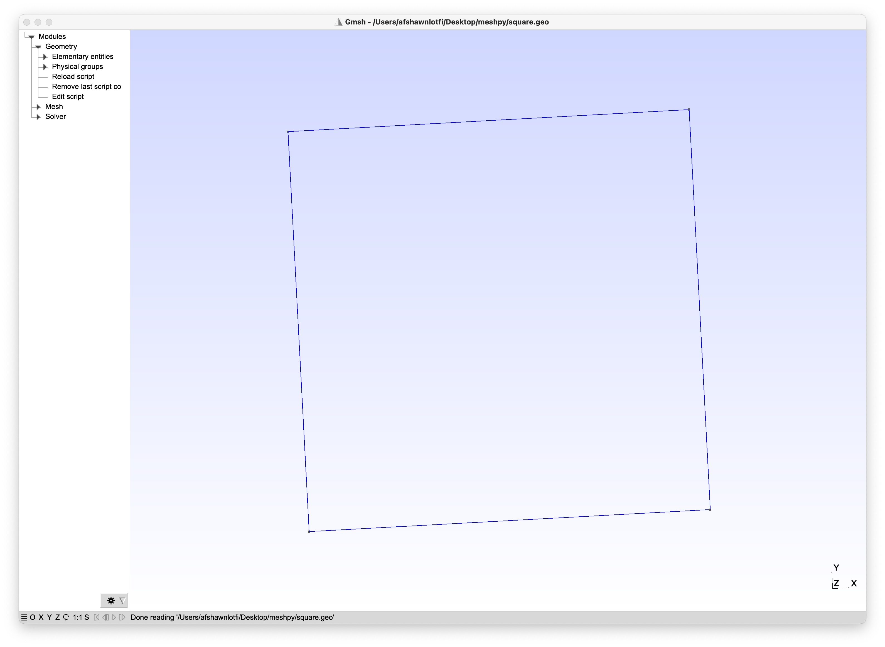

# MeshPy
Open-source Python library for generating CFD meshes

# Install
`pip install git+https://github.com/afshawnlotfi/meshpy.git#egg=meshpy`

# Supported Meshes
* Gmsh Geo (.geo)

# Demo
```python
import numpy as np
from meshpy import ExportType, Mesh

x = np.array([1,3,3,1])
y = np.array([4,4,2,2])
mesh = Mesh.from_coords("square", x, y)
Mesh.export(mesh, "square.geo")
```


# Why?
Just wanted a super simple numpy array to CFD mesh library without all the bloat